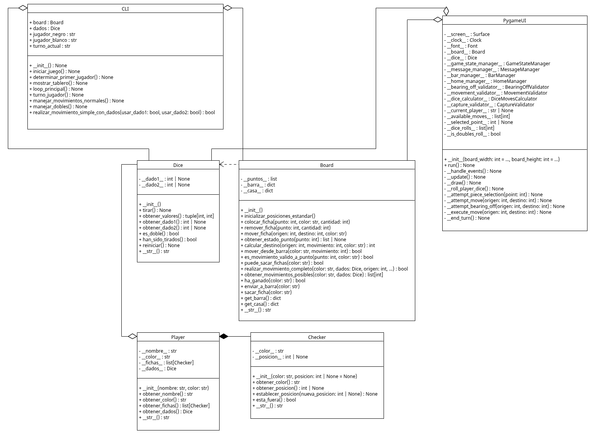
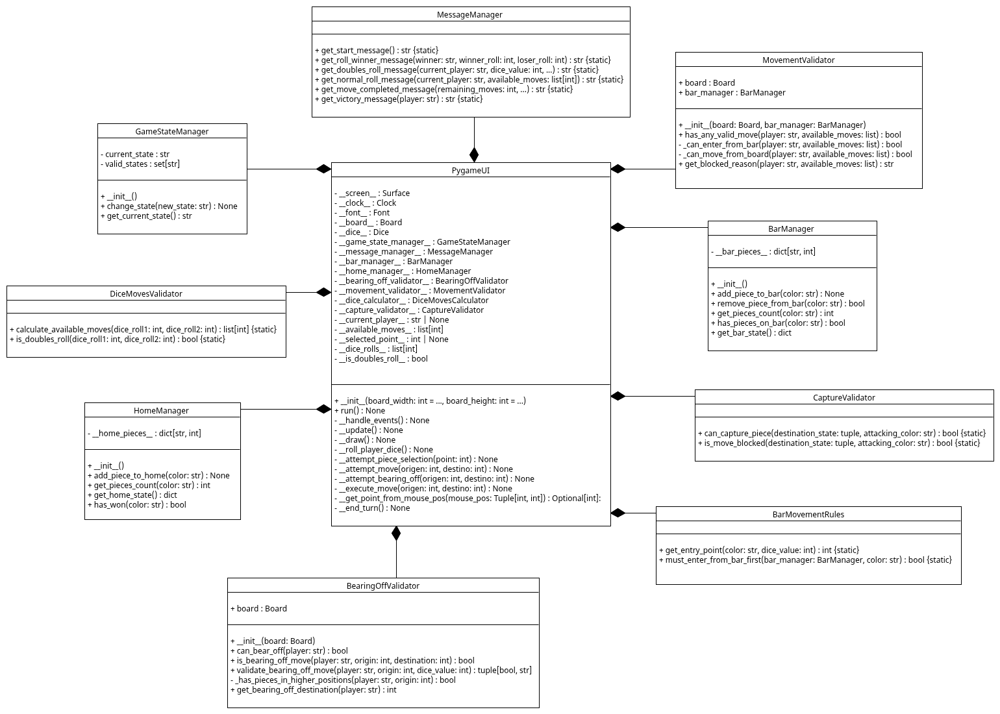

- # JUSTIFICACIÓN DEL PROYECTO FINAL: BACKGAMMON
- ---
- 
- ## Filosofía: Diseño Minimalista
- 
- ### Razones para el diseño minimalista
- 
- - **Separación de responsabilidades** - - Las clases Core representan entidades del dominio.  
- - La lógica de coordinación está en `Board` y las Interfaces.
- 
- ---
- 
- ## Principio de Responsabilidad Única
- 
- - **Checker:** "Soy una ficha de un color"  
- - **Player:** "Soy un jugador con un nombre y color"  
- - **Dice:** "Genero números aleatorios para dados"
- 
- ---
- 
- ## Facilidad de Testing
- 
- - Clases simples → Tests simples  
- - Menos métodos → Menos casos de prueba  
- - Menos dependencias → Menos mocks necesarios
- 
- ---
- 
- ## Inmutabilidad Conceptual
- 
- - Una ficha no cambia su naturaleza  
- - Un jugador no cambia su identidad  
- - Un dado siempre hace lo mismo: generar números
- 
- ---
- 
- ## Detalle de cada Clase Core
- 
- ---
- 
- ## Checker (Ficha)
- 
- ### Responsabilidad
- - Representar una ficha del juego con su color y posición.
- 
- ### Métodos disponibles
- 
- - `obtener_color()`: Devuelve el color de la ficha  
- - `obtener_posicion()`: Devuelve la posición actual  
- - `establecer_posicion()`: Modifica la posición  
- - `esta_fuera()`: Verifica si está fuera del tablero
- 
- ### Justificación del diseño minimalista
- 
- - ✅ No tiene método `mover()` porque el movimiento depende del estado completo del tablero (validaciones, capturas, etc.)  
- - ✅ No tiene método `validar()` porque la validación requiere conocer reglas que cambian según la variante  
- - ✅ Solo gestiona datos porque una ficha es esencialmente una entidad de datos, no un comportamiento
- 
- ### Principios SOLID
- 
- - **SRP:** Una ficha solo se encarga de mantener su estado (color y posición)  
- - **OCP:** Se puede extender para crear `SpecialChecker` sin modificar la clase base  
- - **LSP:** Cualquier subclase de `Checker` puede usarse donde se espera `Checker`  
- - **ISP:** Interfaz mínima — solo expone lo que un cliente necesita de una ficha  
- - **DIP:** No depende de ninguna otra clase del proyecto
- 
- ---
- 
- ## Player (Jugador)
- 
- ### Responsabilidad
- - Representar la identidad y recursos de un jugador.
- 
- ### Métodos disponibles
- 
- - `obtener_nombre()`: Devuelve el nombre del jugador  
- - `obtener_color()`: Devuelve el color asignado  
- - `obtener_fichas()`: Devuelve lista de 15 fichas  
- - `obtener_dados()`: Devuelve el objeto `Dice` del jugador
- 
- ### Justificación del diseño minimalista
- 
- - ✅ No tiene método `hacer_movimiento()` porque la lógica de ejecución está en `Board`  
- - ✅ No tiene método `calcular_estrategia()` porque eso es responsabilidad de:
- -   - La interfaz (para jugadores humanos)  
- -   - Una subclase `AIPlayer` (para jugadores computadora)  
- - ✅ No gestiona turnos porque eso es responsabilidad de `GameStateManager`
- 
- ### ¿Por qué Player tiene Dice?
- 
- - En el backgammon tradicional, cada jugador tiene su propio set de dados.  
- - Esto permite:
- 
- - Representación fiel del juego real  
- - Extensibilidad para variantes donde los dados son diferentes  
- - Posibilidad de juego por turnos asincrónicos (cada uno con sus dados)
- 
- ### Principios SOLID
- 
- - **SRP:** Solo representa identidad y recursos, no lógica de juego  
- - **OCP:** Extensible para crear `AIPlayer`, `RemotePlayer` sin modificar la base  
- - **LSP:** Subclases pueden sustituir a `Player` manteniendo el contrato  
- - **ISP:** Interfaz simple de identificación y acceso a recursos  
- - **DIP:** Depende de abstracciones (`Checker`, `Dice`), no de implementaciones concretas
- 
- ---
- 
- ## Dice (Dados)
- 
- ### Responsabilidad
- - Generar números aleatorios para simular tiradas de dados.
- 
- ### Métodos disponibles
- 
- - `tirar()`: Genera dos números aleatorios (1-6)  
- - `obtener_dado1()`, `obtener_dado2()`: Devuelven valores individuales  
- - `obtener_valores()`: Devuelve tupla con ambos valores  
- - `es_doble()`: Indica si ambos dados tienen el mismo valor  
- - `han_sido_tirados()`: Verifica si se ha realizado una tirada  
- - `reiniciar()`: Prepara para una nueva tirada  
- - `set_dados_para_test()`: Permite inyectar valores para testing
- 
- ### Justificación del diseño minimalista
- 
- - ✅ No tiene método `calcular_movimientos()` porque interpretar los dados (por ejemplo, dobles = 4 movimientos) es lógica de backgammon, no de dados genéricos  
- - ✅ No tiene método `validar_movimiento()` porque validar requiere conocer el estado del tablero  
- - ✅ Separación de generación e interpretación permite reutilizar `Dice` en otros juegos de dados
- 
- ---
- 
- ### Separación de responsabilidades en el proyecto
- 
- - **Dice:** Genera números aleatorios → “Obtuve 3 y 5”  
- - **DiceMovesCalculator:** Interpreta los números → “Tienes 2 movimientos: [3, 5]” o “Tienes 4 movimientos: [6, 6, 6, 6]”  
- - **MovementValidator:** Valida si esos movimientos son posibles → “Puedes usar el 3 pero no el 5”
- 
- ---
- 
- ### Principios SOLID
- 
- - **SRP:** Solo genera números aleatorios, no interpreta resultados  
- - **OCP:** Se puede extender para crear `LoadedDice`, `WeightedDice` sin modificar la base  
- - **LSP:** Cualquier tipo de dado puede sustituir a `Dice`  
- - **ISP:** Interfaz enfocada en generación, no en reglas de juego  
- - **DIP:** Completamente independiente, no depende de otras clases
- 
- ---
- 
- 
- ## Board (Tablero Principal)
- 
- ### Responsabilidad
- - Centralizar la lógica del juego y coordinar las clases Core (`Checker`, `Player`, `Dice`), gestionando movimientos, validaciones, barra y casa.
- 
- ### Métodos principales
- 
- - `inicializar_posiciones_estandar()`: Configura las posiciones iniciales del tablero  
- - `calcular_destino()`: Determina el punto de destino según el color y el valor del dado  
- - `mover_desde_barra()`: Reincorpora fichas desde la barra siguiendo las reglas  
- - `realizar_movimiento_completo()`: Aplica un movimiento con validaciones  
- - `realizar_movimiento_doble()`: Ejecuta movimientos encadenados con ambos dados  
- - `puede_sacar_fichas()`: Evalúa si un jugador puede comenzar a sacar fichas  
- - `ha_ganado()`: Determina si un jugador completó la partida  
- - `obtener_movimientos_posibles()`: Lista los puntos desde donde puede moverse
- 
- ---
- 
- ### Justificación del diseño minimalista
- 
- - ✅ No gestiona interfaz ni turnos (separación de capas)  
- - ✅ No crea jugadores ni dados (inyección de dependencias)  
- - ✅ No maneja persistencia (solo estado temporal del juego)  
- - ✅ Encapsula toda la lógica del tablero sin exponer estructuras internas
- 
- ---
- 
- ### Principios SOLID
- 
- - **SRP:** Gestiona la lógica del tablero, no entidades ni interfaz.  
- - Cada método tiene una única responsabilidad (ej. `calcular_destino` no modifica estado).  
- 
- - **OCP:** Extensible para variantes del juego (por ejemplo, tableros de 12 puntos o movimientos alternativos).  
- - Nuevas reglas pueden implementarse mediante herencia sin modificar la clase base.  
- 
- - **LSP:** Subclases que redefinan reglas de movimiento pueden sustituir `Board` manteniendo compatibilidad.  
- 
- - **ISP:** Expone una interfaz clara y necesaria para operar el tablero (`mover_desde_barra`, `obtener_movimientos_posibles`, `ha_ganado`).  
- 
- - **DIP:** Depende de abstracciones (`Dice`) en lugar de implementaciones; no instancia ni conoce detalles internos de `Checker` o `Player`.  
- 
- ---
- 
- ### Conclusión
- 
- - El diseño de `Board` cumple el rol de **coordinador del dominio**, siendo el núcleo del modelo de negocio.  
- - Gracias a su diseño desacoplado, **permite testeo unitario**, extensión de reglas y reutilización del resto de clases Core sin generar dependencias circulares ni romper el principio de responsabilidad única.
- 
- 
- 
- ## Estrategias de Testing y Cobertura
- 
- ### Enfoque general
- 
- - El testing sigue una **estrategia de cobertura orientada a principios SOLID**.  
- - Cada clase Core cuenta con un archivo de pruebas unitarias que:
- 
- - 1. Verifica funcionalidad esperada (tests de comportamiento).  
- - 2. Evalúa cumplimiento explícito de principios SOLID (tests de arquitectura).  
- - 3. Asegura independencia y testabilidad sin dependencias externas.
- 
- ---
- 
- ### Test_Checker.py
- 
- - Se verifican **constructor y setters/getters**, asegurando que el estado se maneja correctamente.  
- - Los tests están organizados en dos clases:
- -   - `TestCheckerFunctionality`: prueba comportamiento concreto de `Checker`.  
- -   - `TestCheckerSOLID`: valida que se cumplan SRP, ISP, OCP, LSP y DIP.
- - Se justifica cada test con un docstring que indica el principio evaluado.  
- - Ejemplo:
- -   - `test_color_inmutable` verifica **SRP** (identidad inmutable).  
- -   - `test_isp_minimal_interface` confirma **ISP** (interfaz mínima).  
- -   - `test_ocp_extensible_sin_modificacion` demuestra **OCP** (extensión sin modificar la clase base).
- 
- ---
- 
- ### Test_Player.py
- 
- - Comprueba que `Player` solo gestiona identidad y recursos (fichas y dados).  
- - Se testean independencia de fichas, composición sobre herencia (**DIP**) y extensibilidad (**OCP**) con subclases `AIPlayer` y `RemotePlayer`.  
- - Casos específicos:
- -   - `test_dados_propios_jugador`: valida que cada jugador tenga dados independientes (**DIP**).  
- -   - `test_ocp_extensible_for_ai_player`: verifica que se pueda extender sin modificar la clase (**OCP**).  
- -   - `test_lsp_subtypes_maintain_contract`: comprueba que las subclases respeten el contrato (**LSP**).
- 
- ---
- 
- ### Test_Dice.py
- 
- - Tests de **comportamiento**: valores aleatorios, reinicio, detección de dobles, representación textual.  
- - Tests de **arquitectura SOLID**: aseguran independencia de reglas del juego (**DIP**) y enfoque único (**SRP**).  
- - Casos destacados:
- -   - `test_srp_only_generates_random_numbers`: demuestra que `Dice` solo genera números aleatorios.  
- -   - `test_ocp_extensible_for_variants`: comprueba extensión mediante `LoadedDice`.  
- -   - `test_dip_testable_without_mocks`: confirma independencia para testing mediante inyección controlada.
- 
- ---
- 
- ### Test_Board.py
- 
- - Evalúa la integración de las clases Core sin romper el desacoplamiento.  
- - Se prueban:
- -   - Inicialización estándar del tablero.  
- -   - Cálculo de destinos y movimientos válidos.  
- -   - Condiciones de victoria y reincorporación de fichas.  
- - Los docstrings explican qué principio SOLID se está verificando:
- -   - **SRP:** Cada método tiene una única función (ej. `calcular_destino`).  
- -   - **OCP:** El tablero permite variantes sin modificar la clase base.  
- -   - **DIP:** `Board` interactúa con `Dice` sin conocer su implementación.
- 
- ---
- 
- ### Conclusión del testing
- 
- - Todos los tests están documentados con el principio SOLID que justifican.  
- - El enfoque de testing no se limita a probar resultados, sino que garantiza **calidad estructural del diseño**.  
- - Gracias a la simplicidad de las clases Core y su bajo acoplamiento, el proyecto alcanza:
- -   - **Alta cobertura lógica** (todas las rutas de ejecución principales).  
- -   - **Alta cobertura conceptual SOLID** (cada principio validado en código y en pruebas).  
- 
- ---
- 
- ### Decisiones de diseño relevantes
- 
- - **Separación de dominio y coordinación:** - - Las clases `Checker`, `Player`, y `Dice` son entidades puras del dominio, mientras `Board` actúa como coordinador.  
- - **Testing guiado por principios SOLID:** - - Cada test se escribe no solo para validar el “qué”, sino el “por qué” del diseño.  
- - **Composición sobre herencia:** - - Todas las clases evitan dependencias innecesarias y promueven extensibilidad segura.  
- 
- ---
- 
- ## CLI (Interfaz de Texto)
- 
- ### Responsabilidad
- - La clase `CLI` representa la **interfaz textual** del sistema Backgammon.  
- - Su objetivo es permitir la interacción entre el usuario y las clases Core, mostrando información del tablero, solicitando entradas, y coordinando el flujo de la partida.  
- - Actúa como capa de presentación, delegando toda la lógica de negocio al dominio (`Board`, `Dice`, `Player` y `Checker`).
- 
- ---
- 
- ### Métodos disponibles
- 
- - `iniciar_juego()`:  
- - Inicia el flujo principal del juego. Pide los nombres de los jugadores, inicializa el tablero y arranca el bucle principal de turnos.
- 
- - `determinar_primer_jugador()`:  
- - Realiza tiradas iniciales con los dados para decidir qué jugador comienza la partida.  
- - No modifica el estado del dominio; solo interactúa con el usuario.
- 
- - `mostrar_tablero()`:  
- - Presenta en consola el estado actual del tablero, incluyendo fichas, barra y casa.  
- - No altera datos, solo los formatea para visualización.
- 
- - `loop_principal()`:  
- - Controla el ciclo de turnos hasta que uno de los jugadores gana.  
- - Su única responsabilidad es coordinar el flujo, sin intervenir en la lógica de victoria ni validaciones.
- 
- - `turno_jugador()`:  
- - Gestiona el flujo de cada turno: tirada de dados, consulta de movimientos posibles y llamada a los manejadores (`manejar_movimientos_normales` o `manejar_dobles`).  
- - Delegación pura al dominio para ejecutar las reglas del juego.
- 
- - `mostrar_movimientos_disponibles()`:  
- - Lista los puntos desde los cuales el jugador actual puede mover sus fichas.  
- - Cumple una función informativa, sin modificar el estado interno.
- 
- - `manejar_movimientos_normales()`:  
- - Orquesta el flujo de jugadas cuando los dados son diferentes.  
- - Llama a `realizar_movimiento_simple_con_dados()` con los valores apropiados, sin aplicar reglas directamente.
- 
- - `manejar_dobles()`:  
- - Coordina los movimientos cuando la tirada es doble (cuatro movimientos posibles).  
- - Encapsula el flujo específico sin afectar la lógica del tablero.
- 
- - `realizar_movimiento_simple_con_dados(usar_dado1, usar_dado2)`:  
- - Ejecuta un movimiento con uno o ambos dados según las opciones ingresadas por el usuario.  
- - Usa los métodos públicos del `Board` para validar y aplicar los movimientos.
- 
- - `realizar_movimiento_simple()`:  
- - Método simplificado de compatibilidad que delega en el anterior.  
- - Mantiene la consistencia del flujo en versiones anteriores de la CLI.
- 
- - `realizar_movimiento_doble()`:  
- - Gestiona movimientos que combinan ambos valores de los dados.  
- - Llama a las funciones del tablero encargadas de realizar movimientos dobles.
- 
- - `main()`:  
- - Punto de entrada que crea una instancia de `CLI` y ejecuta el juego, manejando excepciones globales.  
- - Encapsula el arranque de la aplicación y la finalización limpia del programa.
- 
- ---
- 
- ### Justificación del Diseño (Separación de Capas)
- 
- - ✅ **Separación de capas:** la `CLI` no contiene lógica de juego ni reglas.  
- - Toda la lógica de dominio permanece en `Board`, `Dice` y `Player`.  
- 
- - ✅ **Independencia del dominio:** el flujo de la interfaz no modifica estados del Core directamente; solo utiliza sus métodos públicos.  
- 
- - ✅ **Extensibilidad:** se puede reemplazar la CLI por una interfaz gráfica (Pygame o WebApp) sin alterar el núcleo.  
- 
- - ✅ **Bajo acoplamiento:** la `CLI` no crea ni mantiene dependencias internas del Core, solo lo coordina.  
- 
- ---
- 
- ### Principios SOLID
- 
- - **SRP (Single Responsibility Principle):** - - La `CLI` se encarga únicamente de la interacción textual con el usuario.  
- - Cada método cumple una única tarea (mostrar, leer o coordinar flujo), evitando responsabilidades múltiples.
- 
- - **OCP (Open/Closed Principle):** - - Se pueden agregar nuevos comandos o menús sin modificar los existentes.  
- - Por ejemplo, agregar una opción “Guardar partida” solo requiere un nuevo método, sin tocar la lógica central.
- 
- - **LSP (Liskov Substitution Principle):** - - La `CLI` puede sustituirse por otra clase (por ejemplo, `GUI` o `WebInterface`) que implemente los mismos métodos públicos.  
- - El resto del sistema seguiría funcionando sin cambios.
- 
- - **ISP (Interface Segregation Principle):** - - Expone una interfaz mínima y coherente: mostrar información, leer datos y ejecutar turnos.  
- - No fuerza la implementación de métodos innecesarios.
- 
- - **DIP (Dependency Inversion Principle):** - - Depende de las **abstracciones del Core**, no de sus detalles internos.  
- - Usa métodos públicos (`Board`, `Dice`) sin conocer su estructura interna ni manipular sus atributos.
- 
- ---
- 
- ### Estrategias de Testing y Cobertura (archivo `Test_CLI.py`)
- 
- - El archivo `Test_CLI.py` valida que la interfaz cumpla los principios SOLID y mantenga bajo acoplamiento con el dominio.  
- - A diferencia de las pruebas de las clases Core, aquí se verifica principalmente la **estructura**, **flujo** y **desacoplamiento** de la capa de presentación.
- 
- #### Estrategias empleadas
- 
- - **Simulación de entrada/salida:** - - Se usan `unittest.mock.patch` y `io.StringIO` para simular la entrada del usuario (`input`) y capturar la salida (`print`), evitando interacciones reales.
- 
- - **Verificación de flujo de ejecución:** - - Se testean las rutas principales (`iniciar_juego()`, `mostrar_tablero()`, `turno_jugador()`, `loop_principal()`) asegurando que no se produzcan efectos secundarios en el dominio.
- 
- - **Uso de mocks:** - - Se emplean mocks para `Board` y `Dice`, verificando que la CLI se comunique con ellos solo a través de sus métodos públicos (cumpliendo **DIP**).
- 
- - **Cobertura de responsabilidades:** - - Cada test confirma que los métodos cumplen **SRP**, y que las operaciones de I/O no mezclan lógica interna del juego.
- 
- - **Documentación interna:** - - Cada test cuenta con un docstring que explica qué principio SOLID está validando, reforzando la trazabilidad entre los objetivos de diseño y las pruebas implementadas.
- 
- #### Principios SOLID validados mediante testing
- 
- - **SRP:** los métodos de la CLI realizan una sola acción (mostrar, leer o coordinar).  
- - **OCP:** se comprueba que la interfaz pueda extenderse sin romper compatibilidad.  
- - **LSP:** los tests aseguran que otra interfaz puede reemplazar la CLI manteniendo el mismo contrato.  
- - **ISP:** la interfaz expone solo los métodos necesarios para la interacción.  
- - **DIP:** la CLI depende de las abstracciones del Core (simuladas con mocks) sin conocer sus detalles.
- 
- ---
- 
- ### Conclusión
- 
- - La `CLI` es una capa de presentación **simple, extensible y completamente desacoplada** del núcleo del juego.  
- - Su diseño y las pruebas que la acompañan confirman que respeta los **principios SOLID**, mantiene alta cohesión y bajo acoplamiento, y puede evolucionar hacia interfaces más complejas (GUI, red o web) sin alterar la arquitectura central del proyecto.
- 
- ---
- 
- ## PygameUI (Interfaz Gráfica)
- 
- ### Responsabilidad
- - La clase `PygameUI` representa la **interfaz gráfica** del sistema Backgammon, utilizando la biblioteca Pygame.
- 
- - Su objetivo es permitir la interacción visual e intuitiva (mediante clics y teclado) entre el usuario y las clases Core. Actúa como la capa de presentación principal, delegando toda la lógica de negocio al dominio (`Board`) y a un conjunto de clases gestoras y validadoras especializadas.
- 
- - A diferencia de la `CLI`, la complejidad de la gestión de estados gráficos, clics, y reglas visuales se descompone en múltiples clases auxiliares para mantener un alto cumplimiento del **Principio de Responsabilidad Única (SRP)**.
- 
- ---
- 
- ### Clases y Métodos Disponibles
- 
- - La `PygameUI` orquesta un conjunto de clases, cada una con una responsabilidad definida:
- 
- - **`PygameUI` (Clase Principal):**
- -   - `run()`: Inicia y mantiene el bucle principal del juego (game loop).
- -   - `__handle_events()`: Captura eventos de Pygame (teclado y mouse) y los dirige.
- -   - `__handle_roll_request()`: Gestiona la pulsación de la tecla 'R' según el estado del juego (inicio, tirar dados, saltar turno).
- -   - `__handle_piece_selection()` / `__attempt_move()`: Coordinan la lógica de seleccionar una ficha (origen) y un destino.
- -   - `__execute_move()`: Aplica un movimiento validado al `Board`, gestionando capturas y actualización de dados.
- -   - `__attempt_bearing_off()`: Maneja la lógica específica de sacar fichas del tablero.
- -   - `__end_turn()`: Limpia el estado del turno actual y pasa al siguiente jugador.
- -   - `__draw()`: Orquesta todos los métodos de dibujado (`__draw_board__`, `__draw_checkers__`, `__draw_dice__`, etc.).
- -   - `__get_point_from_mouse_pos()`: Traduce coordenadas (x, y) del mouse a un punto lógico del tablero (1-24, 0 para barra, 25 para casa).
- 
- - **Clases Gestoras (Managers) y Validadoras (Validators):**
- -   - `GameStateManager`: Mantiene y valida el estado actual del juego (`START_ROLL`, `AWAITING_ROLL`, `AWAITING_PIECE_SELECTION`, etc.).
- -   - `DiceMovesCalculator`: Interpreta la tirada de dados (ej. dobles = 4 movimientos).
- -   - `MessageManager`: Centraliza la creación de todos los mensajes mostrados al usuario.
- -   - `MovementValidator`: Valida si un jugador tiene movimientos posibles, consultando al `Board` y `BarManager`.
- -   - `BarManager`: Gestiona el estado de las fichas en la barra (capturadas).
- -   - `HomeManager`: Gestiona el conteo de fichas que han salido del tablero (casa) y detecta la victoria.
- -   - `CaptureValidator`: Contiene lógica pura para determinar si un movimiento resulta en captura o está bloqueado.
- -   - `BearingOffValidator`: Contiene la lógica específica para validar si un jugador puede sacar fichas y si un movimiento de "bearing off" es legal.
- 
- ---
- 
- ### Justificación del Diseño (Separación de Capas y SRP)
- 
- - ✅ **Separación de Capas:** `PygameUI` y sus clases auxiliares no contienen lógica de reglas de negocio. Delegan el 100% de la manipulación del estado del tablero a la clase `Board` del Core.
- 
- - ✅ **Alta Cohesión y SRP:** La decisión de diseño más importante fue *no* colocar toda la lógica de la UI en una única clase `PygameUI` (lo que la convertiría en una "Clase Dios"). En su lugar, la complejidad se descompone en clases pequeñas y cohesivas (`GameStateManager`, `MovementValidator`, `BarManager`, etc.), cada una con una Responsabilidad Única. `PygameUI` actúa solo como **coordinador** de estas clases.
- 
- - ✅ **Independencia del Dominio:** El flujo de la GUI no modifica estados del Core directamente; solo utiliza sus métodos públicos (`board.mover_ficha`, `board.obtener_estado_punto`).
- 
- - ✅ **Extensibilidad:** Se puede reemplazar la `PygameUI` por una `WebInterface` sin alterar el Core. Además, se pueden añadir nuevas funcionalidades a la UI (ej. un `TimerManager`) sin modificar las clases gestoras existentes.
- 
- ---
- 
- ### Principios SOLID
- 
- - **SRP (Single Responsibility Principle):** - - Este principio se aplica a dos niveles. La `PygameUI` como un todo solo se encarga de la **presentación y coordinación**. Internamente, cada clase gestora (`GameStateManager`, `MessageManager`, `BarManager`, `HomeManager`, etc.) tiene una responsabilidad única y bien definida (gestionar estados, mensajes, barra, casa).
- 
- - **OCP (Open/Closed Principle):** - - La arquitectura está abierta a la extensión. Se pueden agregar nuevos elementos visuales (ej. un dado de apuestas) o nuevas clases gestoras (ej. `SoundManager`) sin modificar la lógica de `PygameUI` o del `Board`.
- 
- - **LSP (Liskov Substitution Principle):** - - La `PygameUI` podría ser sustituida por cualquier otra interfaz (como la `CLI`) que interactúe con el `Board` a través de su API pública, demostrando la intercambiabilidad de las capas de presentación.
- 
- - **ISP (Interface Segregation Principle):** - - La `PygameUI` expone una interfaz pública mínima (`run()`). Internamente, interactúa con interfaces segregadas de cada gestor (ej. solo usa `get_pieces_count` de `BarManager` para dibujar, y `MovementValidator` usa `has_pieces_on_bar`).
- 
- - **DIP (Dependency Inversion Principle):** - - `PygameUI` (alto nivel) depende de las **abstracciones del Core** (`Board`, `Dice`) y de sus propias **abstracciones de UI** (`MovementValidator`, `GameStateManager`). Instancia estas clases en su constructor, aplicando Inyección de Dependencias (aunque sea mediante composición) y asegurando que la lógica de alto nivel no dependa de detalles de bajo nivel.
- 
- ---
- 
- ### Estrategias de Testing y Cobertura (archivo `Test_PygameUI.py`)
- 
- - El archivo `Test_PygameUI.py` es la suite de pruebas más completa del proyecto, ya que debe validar no solo la clase `PygameUI` sino también todas sus clases gestoras y validadoras auxiliares.
- 
- #### Estrategias empleadas
- 
- - **Simulación de Entorno Gráfico:** - - Se utiliza `os.environ["SDL_VIDEODRIVER"] = "dummy"` para ejecutar Pygame en memoria sin levantar una ventana real. Funciones clave como `pygame.display.set_mode` y `pygame.font.Font` son *parcheadas* (`patch`) para devolver objetos `Mock` o superficies (`Surface`) funcionales.
- 
- - **Testing de Clases Gestoras (SRP):** - - Se dedican suites de pruebas específicas para validar las responsabilidades únicas de cada clase gestora (`TestDiceMovesCalculator`, `TestGameStateManager`, `TestMessageManager`, `TestMovementValidator`, `TestPygameUICoverageExtension` para `BarManager` y `CaptureValidator`). Esto asegura que el **SRP** se cumple.
- 
- - **Testing de Lógica de UI (Flujo):** - - Mediante `patch` de `pygame.event.get`, se simulan clics y pulsaciones de teclas para probar flujos completos de usuario, como saltar un turno (`TestSkipTurnFunctionality`), gestionar dobles (`TestDoublesValidation`) o sacar fichas (`TestBearingOffFunctionality`).
- 
- - **Testing de Renderizado y Clics:** - - Se valida la lógica de **traducción de coordenadas** (`TestPygameUIClickDetection`) para asegurar que un clic en una posición (x, y) se traduce al punto lógico correcto (ej. 1-24). Los métodos de dibujo se prueban usando `@patch` para verificar que *intentan* dibujar (ej. `@patch("pygame.draw.polygon")`).
- 
- - **Documentación y Cobertura SOLID:** - - Al igual que en `Test_CLI.py`, cada test o suite de tests incluye un docstring que explica el principio SOLID que está validando, conectando el diseño teórico con la implementación probada.
- 
- ---
- 
- ### Conclusión
- 
- - La `PygameUI` representa una evolución de la `CLI`, demostrando una arquitectura de UI robusta y escalable. Su principal fortaleza de diseño es la aplicación intensiva del **Principio de Responsabilidad Única**, descomponiendo la alta complejidad de una GUI en múltiples clases gestoras y validadoras.
- 
- - Está **completamente desacoplada del Core**, depende de abstracciones (cumpliendo **DIP**) y valida su arquitectura y funcionalidad mediante una suite de tests exhaustiva que cubre desde la lógica de estado hasta la simulación de eventos gráficos.

# Anexos: Diagramas UML

### Diagrama General de Clases

Aquí se muestra la estructura principal del proyecto, incluyendo las clases del Core y las Interfaces:

### Detalle de la Arquitectura de PygameUI

Este diagrama muestra en detalle la clase `PygameUI` y cómo se compone de sus clases auxiliares:

